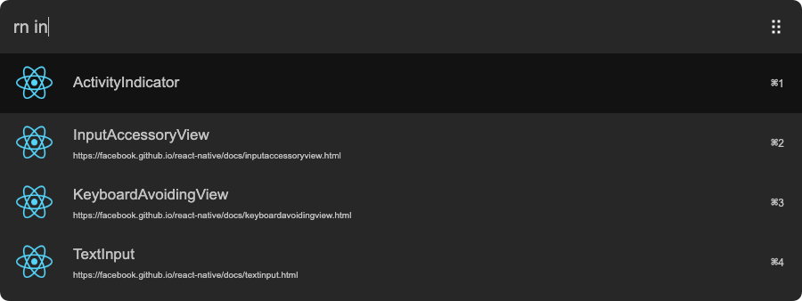

# arvis-react-native
> [Arvis](https://github.com/jopemachine/arvis) workflow to access the React Native Documentation



## 🔗 This workflow is converted from [alfred-workflow](https://github.com/manosim/alfred-react-native).

* Note that there might be some code change or different actions from the original workflow.

* Marked original workflow's creator to author.

## Install

```
npm i -g arvis-react-native
```

## Usage

In arvis, type rn, Enter, and your query, to search for documentation of components.
Select a component and press Enter to go to its GitHub repo.

## Thanks

Thanks to [sindresorhus](https://github.com/sindresorhus) for making [alfy](https://github.com/sindresorhus/alfy). It works great - made this workflow in 15 minutes.
